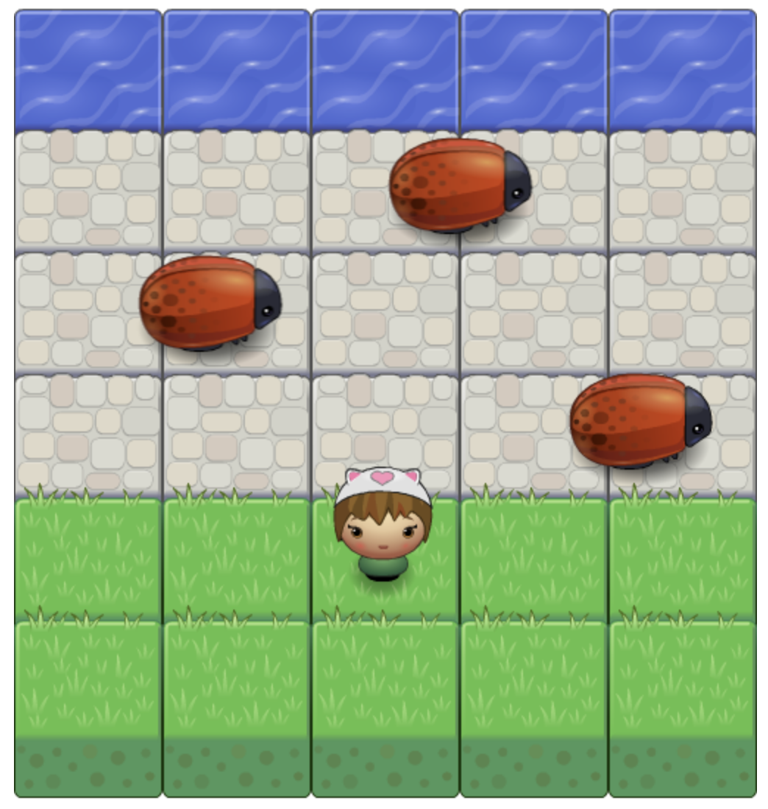

# Classic Arcade Game Project
This is a arcade game based on the classic game, Frogger.
The game is implemented using vanilla Javascript and Canvas (HTML5).



## Table of Contents

- [Instructions](#instructions)
- [Game Rules](#rules)

## Instructions

* To play, just open [index.html](./index.html) in your browser.

## Game Rules

* To win, get your character to the river
* If you get hit by one of the ladybugs, you return to the start

## Development
To setup the app for development on your local machine, please follow the instructions below:
1. Clone the repo to your machine
```
git clone https://github.com/bilafish/carpark-finder.git
```
2. Edit the Javascript code in folder [js](./js/)
